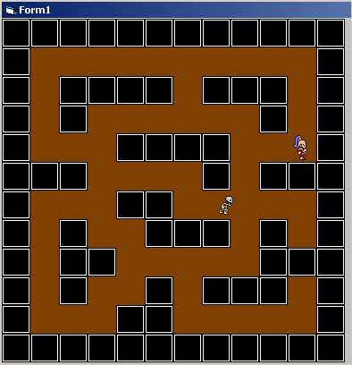



## PATH FINDING ALGORITHM

### Description

simple path finding example. Also shows some sprite animation. Use arrow keys to move the hero around the map and watch the skeleton follow you around. Enjoy ..
 
### More Info
 

             |
---                |---
**Submitted On**   |2005-05-24 03:04:18
**By**             |[Foundations Software](https://github.com/Planet-Source-Code/PSCIndex/blob/master/ByAuthor/foundations-software.md)
**Level**          |Intermediate
**User Rating**    |4.6 (23 globes from 5 users)
**Compatibility**  |VB 6\.0
**Category**       |[Games](https://github.com/Planet-Source-Code/PSCIndex/blob/master/ByCategory/games__1-38.md)
**World**          |[Visual Basic](https://github.com/Planet-Source-Code/PSCIndex/blob/master/ByWorld/visual-basic.md)
**Archive File**   |[PATH\_FINDI1891545242005\.zip](https://github.com/Planet-Source-Code/foundations-software-path-finding-algorithm__1-60655/archive/master.zip)

